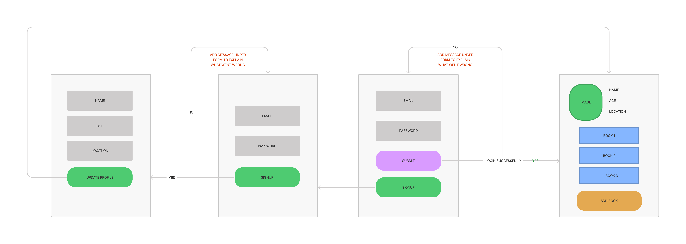

# WEEK 03 Authentication Project

## Michael, Mohamed & Cemal

Authentication Project Week 03

### Research and Design

#### Page flow

### 🧱 Features

- Example

### 📝 User Stories

- [x] A form for users to submit data

### Stretch criteria 🚂

- [ ] A way to view filtered/sorted data, instead of just all of it

### Database Schema

### 📚 What we learnt

- How to create a database with `PostgreSQL`

### 🧪 Testing

- [x] `Cypress` test if items appear on page
- [x] `Cypress` test to add new items
- [x] `Cypress` reset state between each test

### ⏳ Future improvements

- [ ] Modularise all code
- [ ] Sign-up and Login
- [ ] Buy button
- [ ] Delete button
- [ ] No time button
- [ ] No user registration
- [ ] CI Testing on GitHub

### 👀 Screenshots
