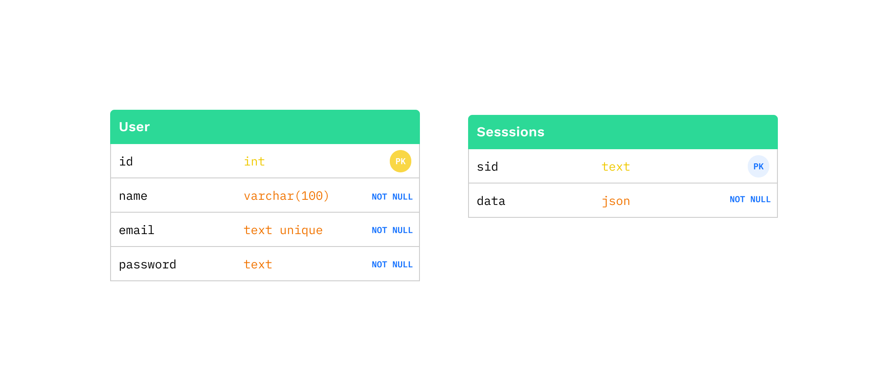
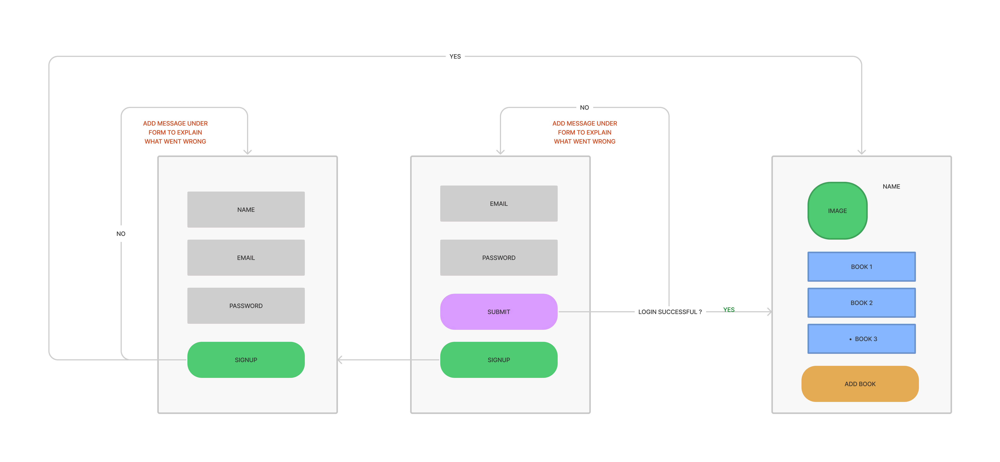
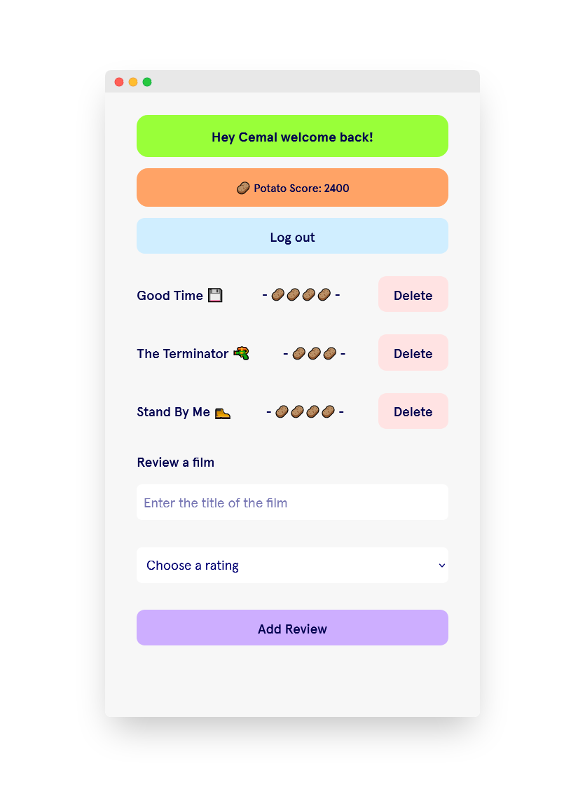
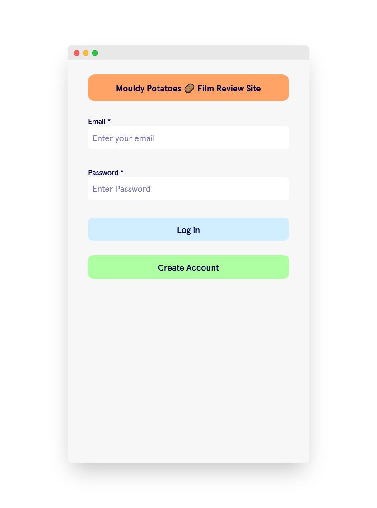

# WEEK 03 Authentication Project

## Mouldy Potatoes 🥔

Authentication Project Week 03

### Research and Design

#### Page flow

### 🧱 Features

- [x] Login page
- [x] Create Account page
- [x] Profile page with film reviews
- [x] Each profile has score based on number of reviews left
- [x] Delete film reviews
- [x] Colourful layout
- [x] Mobile First

### 📝 User Stories

#### Acceptance Criteria

- [x] Forms for users to sign up and log in
- [x] A form for users to submit data only accessible to logged in users
- [ ] A page showing all the data
- [x] A way for logged in users to delete their own data
- [ ] Semantic form elements with correctly associated labels
- [x] A Postgres database hosted on Heroku
- [x] Hidden environment variables (i.e. not on GitHub)

##### Stretch criteria

- [x] Tests for all routes
- [x] A user page that shows everything posted by a single user
- [x] GitHub Actions CI setup to run your tests when you push

### 📚 What we learnt

- Always add `bodyParser` otherwise the `body.response` will returned `undefined` OR `server.use(express.urlencoded({ extended: false }));`
- Make sure to `module.exports` functions
- Do not `modularise` code from the start (jumping around is a nightmare 😔)
- Writing `cookies` with sessionID's
- Hashing and Salting passwords
- More SQL
- How to setup a project quicker (sort of)

### 🧪 Testing

- [x] `Cypress` test if items appear on page
- [x] `Cypress` test to add new items
- [x] `Cypress` reset state between each test

### ⏳ Future improvements

- [ ] Show reviews from all users
- [ ] Desktop version
- [ ] More detail in reviews
- [ ] More exciting design
- [ ] Accessible forms and HTML elements

### 👀 Screenshots

